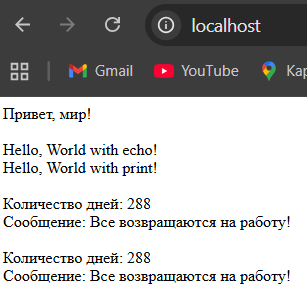

# containers07

## Лабораторная работа 7 по CV

## Цель работы

Ознакомиться с работой многоконтейнерного приложения на базе docker-compose.

## Задание

Создать php приложение на базе трех контейнеров: nginx, php-fpm, mariadb, используя docker-compose.

## Выполнение

Взял из говового containers06 и перенёс его на containers07.

Далее создал в директории containers07 файл ```docker-compose.yml``` со следующим содержимым:

```
version: '3.9'

services:
  frontend:
    image: nginx:1.19
    volumes:
      - ./mounts/site:/var/www/html
      - ./nginx/default.conf:/etc/nginx/conf.d/default.conf
    ports:
      - "80:80"
    networks:
      - internal
  backend:
    image: php:7.4-fpm
    volumes:
      - ./mounts/site:/var/www/html
    networks:
      - internal
    env_file:
      - mysql.env
  database:
    image: mysql:8.0
    env_file:
      - mysql.env
    networks:
      - internal
    volumes:
      - db_data:/var/lib/mysql

networks:
  internal: {}

volumes:
  db_data: {}
```

Создал файл ```mysql.env``` в корне проекта и добавьте в него строки:

```
MYSQL_ROOT_PASSWORD=secret
MYSQL_DATABASE=app
MYSQL_USER=user
MYSQL_PASSWORD=secret
```

## Запуск и тестирование

Запустиk контейнеры командой:
``` docker-compose up -d ```
И проверил работу сайта в браузере, перейдя по адресу ``` http://localhost ```.


### Ответьте на вопросы

1. В каком порядке запускаются контейнеры?
    У контейнеров нет строгого порядка.
2. Где хранятся данные базы данных?
    В томе Docker.
3. Как называются контейнеры проекта?
    mysql:8.0; php:7.4-fpm; nginx:1.19 .
4. Вам необходимо добавить еще один файл app.env с переменной окружения APP_VERSION для сервисов backend и frontend. Как это сделать?
    Создать файл ```app.env```
    Подключить к ```docker-compose.yml```
    Перезапустить
    Проверить

## Выводы

Ознакомился с работой многоконтейнерного приложения на базе docker-compose.
